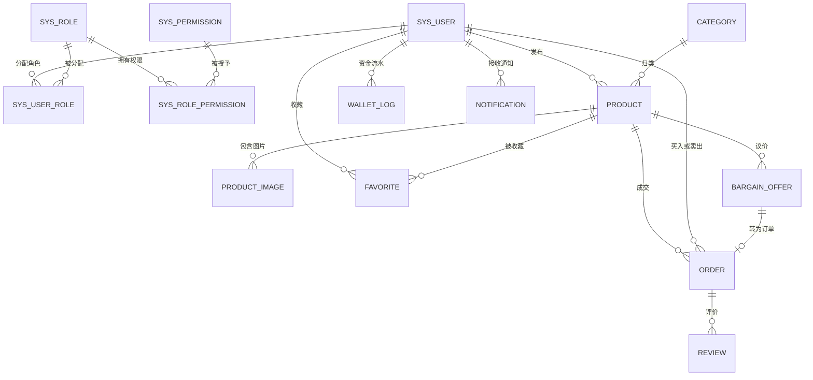
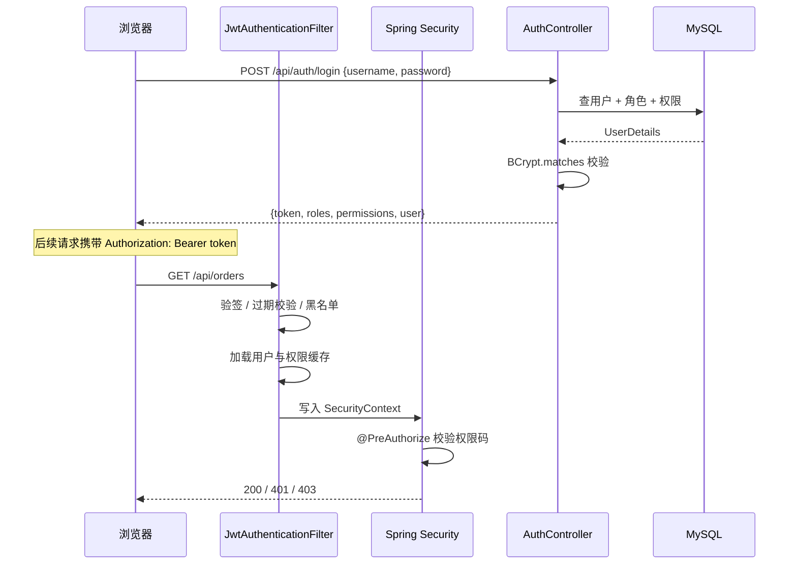

# 报告用图（Mermaid 源码）

> 说明：下列两张图我本地没有可用的 Mermaid 渲染器，请在 <https://mermaid.live> 或 IDEA 的 Mermaid 插件中粘贴渲染后，导出 PNG 插入报告对应位置。

## 图 3-6  E-R 图（16 张表的核心关系）

```mermaid
erDiagram
    SYS_USER ||--o{ SYS_USER_ROLE : "分配角色"
    SYS_ROLE ||--o{ SYS_USER_ROLE : "被分配"
    SYS_ROLE ||--o{ SYS_ROLE_PERMISSION : "拥有权限"
    SYS_PERMISSION ||--o{ SYS_ROLE_PERMISSION : "被授予"
    SYS_USER ||--o{ PRODUCT : "发布"
    CATEGORY ||--o{ PRODUCT : "归类"
    PRODUCT ||--o{ PRODUCT_IMAGE : "包含图片"
    SYS_USER ||--o{ FAVORITE : "收藏"
    PRODUCT ||--o{ FAVORITE : "被收藏"
    PRODUCT ||--o{ ORDER : "成交"
    SYS_USER ||--o{ ORDER : "买入或卖出"
    PRODUCT ||--o{ BARGAIN_OFFER : "议价"
    BARGAIN_OFFER ||--o| ORDER : "转为订单"
    ORDER ||--o{ REVIEW : "评价"
    SYS_USER ||--o{ WALLET_LOG : "资金流水"
    SYS_USER ||--o{ NOTIFICATION : "接收通知"
```

## 图 3-7  登录与鉴权时序图

```mermaid
sequenceDiagram
    participant B as 浏览器
    participant F as JwtAuthenticationFilter
    participant S as Spring Security
    participant C as AuthController
    participant DB as MySQL
    B->>C: POST /api/auth/login {username, password}
    C->>DB: 查用户 + 角色 + 权限
    DB-->>C: UserDetails
    C->>C: BCrypt.matches 校验
    C-->>B: {token, roles, permissions, user}
    Note over B: 后续请求携带 Authorization: Bearer token
    B->>F: GET /api/orders
    F->>F: 验签 / 过期校验 / 黑名单
    F->>F: 加载用户与权限缓存
    F->>S: 写入 SecurityContext
    S->>S: @PreAuthorize 校验权限码
    S-->>B: 200 / 401 / 403
```
